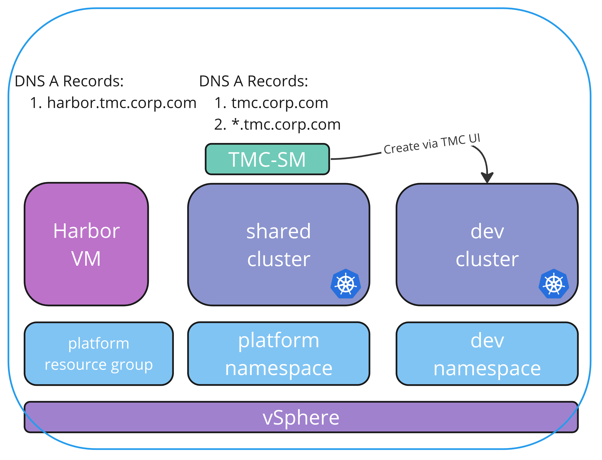

# TMC Self-Managed Opinionated Install Guide

Pre requirement before start: 
 - Harbor with proper CA Cert chain.
    - ```00-prep.sh``` script will validate the Harbor's Certificates.
    - If Certs cannot be trusted in chain, it will intentionally throw error and stop.
    - You can deploy harbor via this repo. See instructions below.
 - If you're using your own certificates, 
    - make sure that updating ```templates/values-template.yaml``` file with:
        - ```tmc_ca``` section for Root CA Cert and their Intermediate Cert that will hold Certs for TMC domain. Example: CA Cert for *.tmc.corp.com
        - ```tmc_key``` section for Root CA Cert's un-encrypted Key for wildcard certs. Example: CA Key for *.tmc.corp.com
        - ```other_ca``` section for all other Root CA Cert and their Intermediate Cert. Example: CA Cert for *.tap.corp.com
        - ```ca_crt``` section for Harbor's Root CA Cert (it can be same as tmc_ca). Example: CA Cert for *.tmc.corp.com
        - ```server_crt``` section for Harbor's Cert. (it can be server-app.crt) Example: Cert for harbor.tmc.corp.com or *.tmc.corp.com
        - ```server_key``` section for Harbor's Cert Key. (it can be server-app.key) Example: Cert Key for harbor.tmc.corp.com or *.tmc.corp.com
 - Have DNS A records to be added for *.tmc.corp.com and tmc.corp.com with pre-selected LB IP address.



## Getting Started Quick

git clone the repo and update the `templates/values-template.yaml` file.

```bash
git clone https://github.com/gorkemozlu/tanzu-gitops
cd tmc-sm/
vi templates/values-template.yaml
```

If you need to create required certificates: (You can use these certs for Harbor as well)
```
$ ./00-prep.sh gen-cert
```

You can easily update the `templates/values-template.yaml` file with CA Certs/Keys with below commands.
```
export TMC_CA_CERT=$(cat ./tmc-ca.crt)
yq e -i ".trustedCAs.tmc_ca = strenv(TMC_CA_CERT)" ./templates/values-template.yaml
export TMC_CA_KEY=$(cat ./tmc-ca-no-pass.key)
yq e -i ".trustedCAs.tmc_key = strenv(TMC_CA_KEY)" ./templates/values-template.yaml
export ALL_CA_CERT=$(cat ./all-ca.crt)
yq e -i ".trustedCAs.other_ca = strenv(ALL_CA_CERT)" ./templates/values-template.yaml

export TMC_CA_CERT=$(cat ./tmc-ca.crt)
yq e -i ".harbor.deploy.ca_crt = strenv(TMC_CA_CERT)" ./templates/values-template.yaml
export HARBOR_SERVER_CRT=$(cat ./server-app.crt)
yq e -i ".harbor.deploy.server_crt = strenv(HARBOR_SERVER_CRT)" ./templates/values-template.yaml
export HARBOR_SERVER_KEY=$(cat ./server-app.key)
yq e -i ".harbor.deploy.server_key = strenv(HARBOR_SERVER_KEY)" ./templates/values-template.yaml

```

For airgapped environments, run the ```00-prep.sh``` script.

Downloading required all packages.
```
$ ./00-prep.sh prep
```

If your jumpbox does not have internet connection, you need to manually transfer downloaded files (TMC-SM files, images etc.) into ```airgapped-files/``` folder.

Importing required all CLIs
```
$ ./00-prep.sh import-cli
```

Deploy Harbor
```
$ ./00-prep.sh deploy-harbor
```

Importing required all packages.
```
$ ./00-prep.sh import-packages
```

Then run the ```01-setup.sh``` for installation.

If you have TKGs on vSphere 7:
```
$ ./01-setup.sh vsphere-7
```

If you have TKGs on vSphere 8:
```
$ ./01-setup.sh vsphere-8
```

If you want to upgrade, place the TMC-SM ```bundle-1.x.x.tar``` file into ```airgapped-files/``` folder, update `templates/values-template.yaml` file with new version and run below command.
```
$ ./02-upgrade.sh
```

## For troubleshooting:

export all pod logs into log files.
```
export ns=tmc-local && kubectl get pods -n $ns --no-headers=true -o custom-columns=:metadata.name | xargs -I {} sh -c 'kubectl get pods -n $ns {} -o jsonpath="{.spec.containers[*].name}" | tr " " "\n" | xargs -I {container} sh -c "kubectl logs -n $ns {} {container} > {}-{container}.log"'
```

export only CrashLoopBackOff pod logs into log files.
```
export ns=tmc-local && kubectl get pods -n $ns --no-headers=true -o custom-columns=:metadata.name | xargs -I {} sh -c 'status=$(kubectl get pod -n $ns {} -o jsonpath="{.status.containerStatuses[*].state.waiting.reason}") && [ "$status" = "CrashLoopBackOff" ] && kubectl get pods -n $ns {} -o jsonpath="{.spec.containers[*].name}" | tr " " "\n" | xargs -I {container} sh -c "kubectl logs -n $ns {} {container} > {}-{container}.log"'
```

extract/read error logs from each log file.
```
for file in *.log; do grep -q "error" "$file" && (echo "=== $file ==="; grep "error" "$file"; echo); done
```

Get all packageinstall-s
```
kubectl get pkgi -A
```

Get all packagerepository-s
```
kubectl get pkgr -A
```

Get all ingress-es
```
kubectl get httpproxy -A
```

Get all certificate-s
```
kubectl get cert -A
```

Get all cluster-issuer-s
```
kubectl get ClusterIssuer -A
```

## DNS Records:

This is the recommended way with wildcard:
|FQDN| IP |
|---|---|
|*.tmc.corp.com| LB IP|
|tmc.corp.com| LB IP|
|harbor.tmc.corp.com| Harbor IP|

If DNS entries need to be manually added, follow below table:
|FQDN| IP |
|---|---|
|harbor.tmc.corp.com| Harbor IP|
|landing.tmc.corp.com|LB IP|
|auth.tmc.corp.com|LB IP|
|s3.tmc.corp.com|LB IP|
|tmc-local.s3.tmc.corp.com|LB IP|
|console.s3.tmc.corp.com|LB IP|
|pinniped-supervisor.tmc.corp.com|LB IP|
|tmc.corp.com|LB IP|
|gts.tmc.corp.com|LB IP|
|gts-rest.tmc.corp.com|LB IP|
|git.tmc.corp.com|LB IP|
|minio-console.tmc.corp.com|LB IP|
|minio.tmc.corp.com|LB IP|
|sample-app.tmc.corp.com|LB IP|
|elastic.tmc.corp.com|LB IP|
|prometheus.tmc.corp.com|LB IP|
|grafana.tmc.corp.com|LB IP|
|kibana.tmc.corp.com|LB IP|
|octant.tmc.corp.com|LB IP|

`LB IP` is the `loadbalancer_ip` value in `templates/values-template.yaml` 